# Maven Roasters Coffee Shop Sales Analysis

# Table of Contents

1. [Introduction](#introduction)
2. [Dataset Overview](#dataset-overview)
   - [About the Dataset](#about-the-dataset)
   - [Columns Description](#columns-description)
3. [Data Cleaning Actions](#data-cleaning-actions)
   - [Initial Inspection](#initial-inspection)
   - [Column Removal](#column-removal)
   - [Summary Statistics for Numerical Columns](#summary-statistics-for-numerical-columns)
   - [Checking for Missing Data](#checking-for-missing-data)
   - [Duplicate Entries Check](#duplicate-entries-check)
   - [Date Format Conversion](#date-format-conversion)
4. [Analysis](#analysis)
   - [Approach](#approach)
   - [Univariate Analysis](#univariate-analysis)
     - [Store Performance](#store-performance)
     - [Items Purchased per Transaction](#items-purchased-per-transaction)
     - [Product Category Purchases](#product-category-purchases)
     - [Price Distribution by Category](#price-distribution-by-category)
     - [Drink Sizes](#drink-sizes)
   - [Time-Series Analysis](#time-series-analysis)
     - [Daily and Monthly Sales Trends](#daily-and-monthly-sales-trends)
     - [Sales per Transaction](#sales-per-transaction)
     - [Weekly and Hourly Sales Trends](#weekly-and-hourly-sales-trends)
   - [Multivariate Analysis](#multivariate-analysis)
5. [Summary of Findings](#summary-of-findings)
6. [Conclusion](#conclusion)
7. [Recommended Actions](#recommended-actions)
   - [Promotional Strategies](#promotional-strategies)
   - [Operational Adjustments](#operational-adjustments)
   - [Marketing Focus](#marketing-focus)
8. [Acknowledgements](#acknowledgements)


# Introduction

This project provides an analysis of the sales data for Maven Roasters, a fictitious coffee shop chain with three locations in New York City. The dataset includes transaction records that capture various aspects of sales performance, product details, and pricing. The goal of this analysis is to derive actionable insights to optimize sales strategies, enhance operational efficiency, and improve customer satisfaction.

# Dataset Overview

### About the Dataset

- **Total Rows:** 149,116
- **Total Columns:** 18

### Columns Description

- **transaction_id:** Unique sequential ID representing an individual transaction
- **transaction_date:** Date of the transaction (MM/DD/YY)
- **transaction_time:** Timestamp of the transaction (HH:MM:SS)
- **store_id:** Unique ID of the coffee shop where the transaction took place
- **store_location:** Location of the coffee shop where the transaction took place
- **product_id:** Unique ID of the product sold
- **transaction_qty:** Quantity of items sold
- **unit_price:** Retail price of the product sold
- **Total_Bill:** Total amount of the transaction
- **product_category:** Description of the product category
- **product_type:** Description of the product type
- **product_detail:** Description of the product detail
- **Size:** Size of the product
- **Month Name:** Name of the month of the transaction
- **Day Name:** Name of the day of the transaction
- **Hour:** Hour of the transaction
- **Month:** Numeric representation of the month
- **Day of Week:** Numeric representation of the day of the week

# Data Cleaning Actions

### Initial Inspection

To begin with, we inspect the structure of the dataset. The dataset comprises 18 columns and 149,116 rows, with various data types including integers, floats, and objects.

```
data.info()
```

Dataset Details:

Type: pandas.core.frame.DataFrame
Entries: 149,116
Columns: 18
Columns Breakdown:

 # | Column                | Non-Null Count | Data Type |
|---|----------------------|---------------|----------|
| 0 | transaction_id       | 149,116      | int64   |
| 1 | transaction_date     | 149,116      | object  |
| 2 | transaction_time     | 149,116      | object  |
| 3 | store_id             | 149,116      | int64   |
| 4 | store_location       | 149,116      | object  |
| 5 | product_id           | 149,116      | int64   |
| 6 | transaction_qty      | 149,116      | int64   |
| 7 | unit_price           | 149,116      | float64 |
| 8 | Total_Bill           | 149,116      | float64 |
| 9 | product_category     | 149,116      | object  |
| 10| product_type         | 149,116      | object  |
| 11| product_detail       | 149,116      | object  |
| 12| Size                 | 149,116      | object  |
| 13| Month Name           | 149,116      | object  |
| 14| Day Name             | 149,116      | object  |
| 15| Hour                 | 149,116      | int64   |
| 16| Month                | 149,116      | int64   |
| 17| Day of Week          | 149,116      | int64   |

```
dtypes: float64(2), int64(7), object(9)
```
The only numerical columns here are `transaction_qty`, `unit_price`, and `Total_Bill`.

### Column Removal

Some columns are redundant or less informative:
```
data.drop(['transaction_time', 'store_id', 'product_id', 'Month', 'Day of Week'], axis=1, inplace=True)
```
- Removed: `transaction_time`, `store_id`, `product_id`, `Month`, `Day of Week`
- Reason: Columns like `transaction_time` are less relevant compared to `transaction_date`, and `store_id` can be replaced by `store_location` which is more descriptive. Similarly, `Month` and `Day of Week` are less useful than `Month Name` and `Day Name`.

### Summary Statistics for Numerical Columns

To understand the distribution of numerical data, boxplots were generated for `transaction_qty`, `unit_price`, and `Total_Bill`.

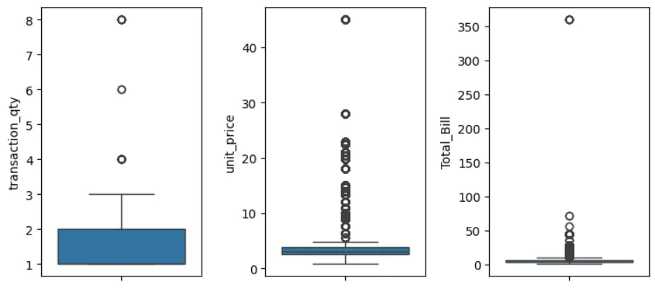

### Findings

Outliers are present in all numerical columns. While high values are noticeable, they may be plausible (e.g., purchasing multiple items or high unit prices). Hence, no outliers were removed.

### Checking for Missing Data

```
data.isna().sum()


transaction_date    0
store_location      0
transaction_qty     0
unit_price          0
Total_Bill          0
product_category    0
product_type        0
product_detail      0
Size                0
Month Name          0
Day Name            0
Hour                0
dtype: int64
```
The dataset was verified for completeness and no missing values were found.

### Duplicate Entries Check

```
duplicate = data[data.duplicated()]
```
No duplicate records were found, ensuring the uniqueness of each transaction.

### Date Format Conversion
```
# Convert 'transaction_date' column to datetime format and save cleaned data to a new CSV file
data['transaction_date'] = pd.to_datetime(data['transaction_date'], format="mixed", dayfirst=True)
data.to_csv('../data/coffee_cleaned.csv', index=False)
```
The date format was standardized for consistency, and the cleaned data was saved to a new CSV file named 'coffee_cleaned.csv'.

# Analysis

### Approach

The analysis started with univariate analysis to assess individual variables. This was followed by time-series analysis to understand trends over time and multivariate analysis to explore relationships between variables.

## Univariate Analysis

#### Store Performance

By aggregating transaction quantities for each store, it's evident that the three stores have almost identical purchase distributions. This suggests that performance is balanced across the stores, with no standout performer.

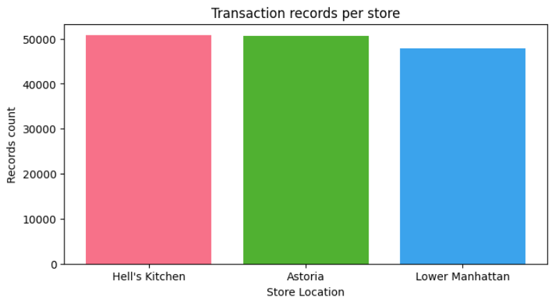

#### Items Purchased per Transaction

Most customers purchase one or two items per transaction.There's an opportunity to increase purchase volume through marketing strategies aimed at encouraging larger transactions (3-5 items).

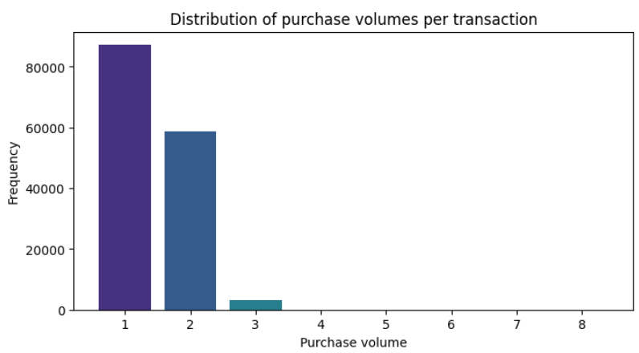

#### Product Category Purchases

Coffee and tea account for nearly 70% of purchases, while coffee beans, loose tea, branded items, and packaged chocolate only make up 2.81%.

Coffee and tea are the most popular, while other categories are less popular. Consider promotional strategies to boost sales in less popular categories.

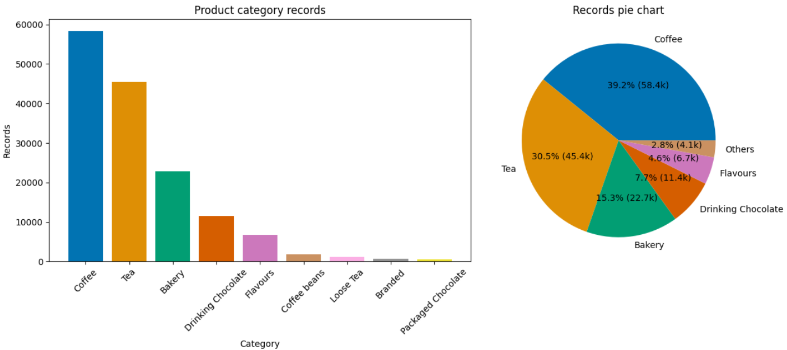

#### Price Distribution by Category

Higher-priced items like loose tea and coffee beans have lower sales volumes. Products with lower prices and less variation in price are sold more frequently.

Immediate consumption products sell more, whereas non-consumables or higher-priced items have lower sales volumes. There’s room for improving sales of less popular items through targeted promotions or pricing strategies.

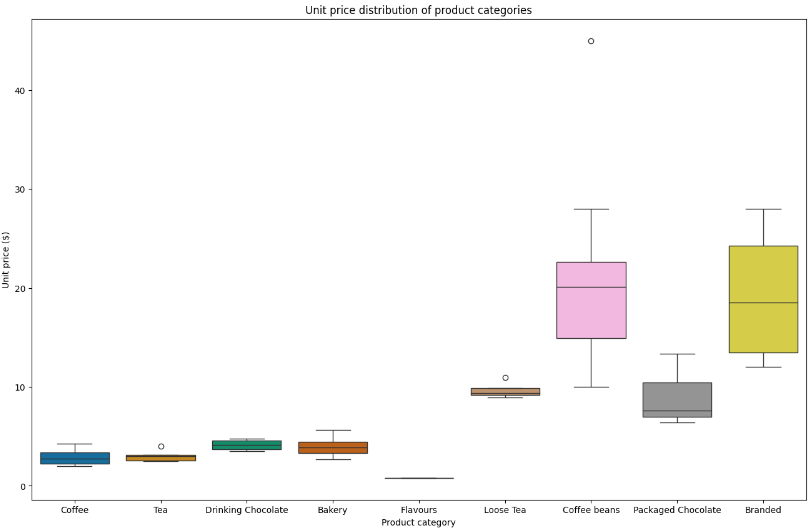

#### Drink Sizes

Regular and large sizes are more commonly purchased. Some drinks have missing size information, but it’s clear that 'Regular' and 'Large' sizes are preferred.

The trend indicates that focusing on regular and large sizes could align with customer preferences.

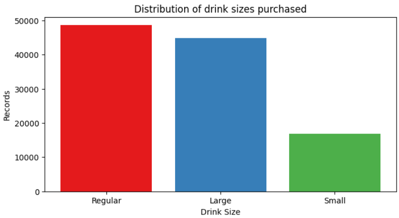

## Time-Series Analysis

#### Daily and Monthly Sales Trends

Sales and transactions show a general increase over time, with consistent dips at the start and end of each month. Sales are growing, with a noticeable increase starting from February.

The positive sales trend suggests growth. However, more data is needed to understand annual seasonality better.

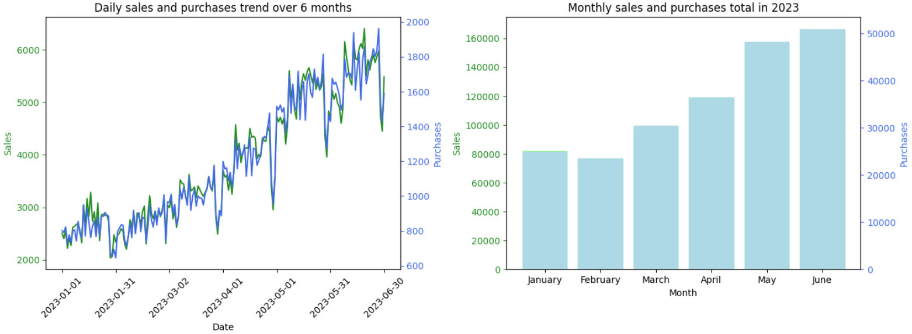


#### Sales per Transaction

Sales per transaction increase from the 21st to the 26th of the month, with fluctuations noticeable around the month's end and beginning.

Sales per transaction show some periodic trends, but variations are minor. This suggests stable performance across different days of the month.

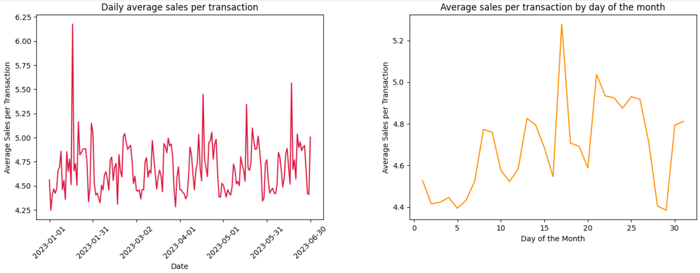


#### Weekly and Hourly Sales Trends

Sales do not vary significantly across days of the week, but there is a noticeable peak in sales from 8 a.m. to 10 a.m.

Peak sales hours (8-10 a.m.) suggest an opportunity to optimize staffing and promotional efforts during these times to leverage higher customer traffic.

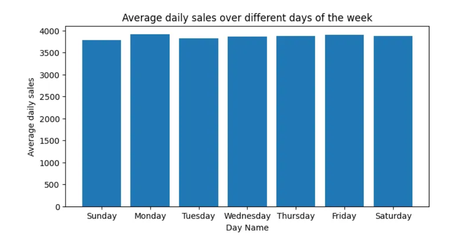
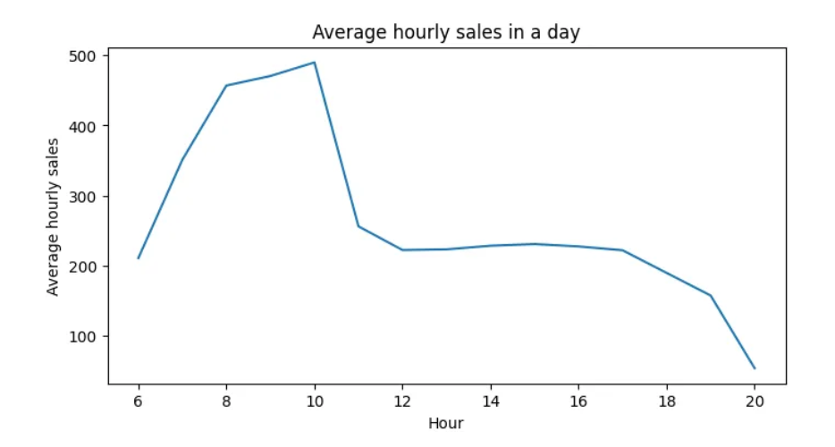

## Multivariate Analysis

Purchase volumes for product categories are similar across all three stores. There are no significant differences in product category preferences among stores, indicating uniform demand.

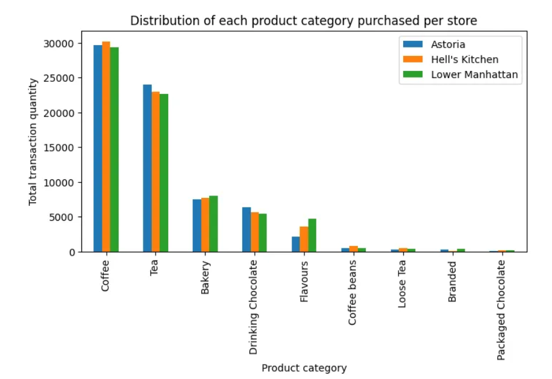

## Summary of Findings:

- **Store Performance:** Sales and transactions are evenly distributed across stores.
- **Transaction Quantity:** Most transactions involve 1-2 items, with potential for growth in larger transactions.
- **Product Preferences:** Coffee and tea dominate sales, while higher-priced items have lower sales volumes.
- **Price Sensitivity:** Lower-priced, immediate-consumption products are more popular.
- **Drink Sizes:** Regular and large sizes are preferred.
- **Sales Trends:** Increasing sales over time with minor cyclical patterns observed monthly.
- **Hourly Trends:** Peak sales occur in the early morning; opportunities exist to optimize operations during peak and off-peak hours.
- **Product Category Distribution:** No clear preference for product categories across different stores.


## Conclusion

This exploratory data analysis offers valuable insights into customer behavior and sales dynamics within the coffee shops. By identifying patterns and trends, we can better understand customer preferences and operational efficiencies. The balanced performance across stores, combined with insights into transaction sizes, product preferences, and sales trends, highlights both strengths and areas for potential growth. 

The analysis underscores the importance of aligning marketing strategies and operational practices with observed consumer behaviors and sales patterns. Leveraging these insights will enable the coffee shops to optimize their offerings, enhance customer satisfaction, and drive sustained growth. As the business continues to evolve, ongoing analysis will be crucial in adapting to changing trends and maintaining competitive advantage.


## Recommended Actions

### Promotional Strategies

- Implement promotions to encourage larger purchases and increase the sales of less popular items.

### Operational Adjustments

- Adjust staff schedules to align with peak sales hours (8-10 a.m.) and manage inventory based on sales patterns.

### Marketing Focus

- Enhance marketing for high-value products and consider strategies to increase the sales of categories with lower transaction volumes.

## Acknowledgements

Thank you to Maven Roasters for providing the dataset for this analysis.
